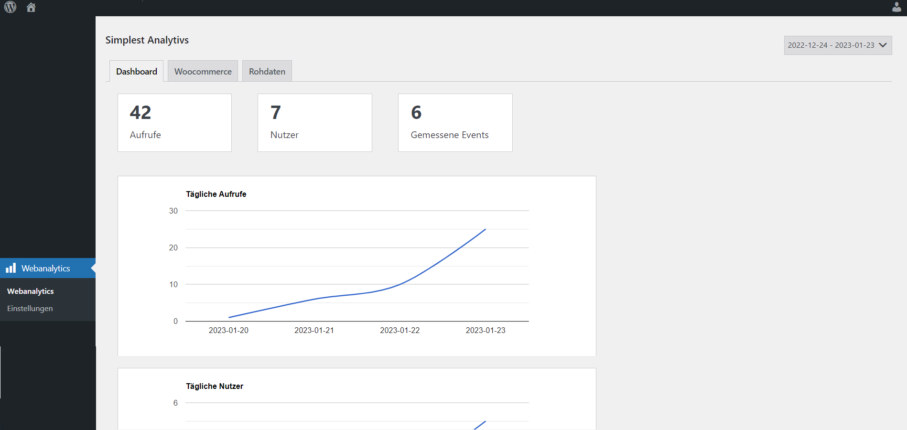

# WordPress Plugin: Simplest Analytics

Simplest Analytics is a WordPress plugin that adds website tracking functionality to WordPress. YOu can download the plugin via the WordPress Backend or the official [WordPress repository](https://de.wordpress.org/plugins/simplest-analytics).

- simplest-analytics: contains the latest version

## Description

Simplest Analytics tracks visits and unique users session based serverside without setting 3rd party cookies. It is also possible to track events and url paramaters. After 
installing and activation the plugin it's working without further configuration. If you want to set up custom tracking events or url parameters you can use the settings tab in 
the WordPress backend.

### What are the main features of the plugin?

* Track page visits and unique users
* Track traffic on sites
* Track where your traffic comes from
* Track where your woocommerce sales come from
* Track custom events when a user clicks an element
* Track the use of url parameters like your-site.com/?campaign=whatever

## Installation

1. zip 'simplest-analytics' folder and upload the zip in to the '/wp-content/plugins/' directory and unzip
2. Activate the plugin through the 'Plugins' menu in WordPress

OR go to 'Plugins' > 'Add new', and search for 'simplest analytics' to install through the WordPress dashboard.

## Do you want to contribute?
1. Please use the code from the 'simplest-analytics' folder
2. Don't forget to take care about the offical [WordPress Codestandards](https://developer.wordpress.org/coding-standards/wordpress-coding-standards/)
3. Send a pull request
